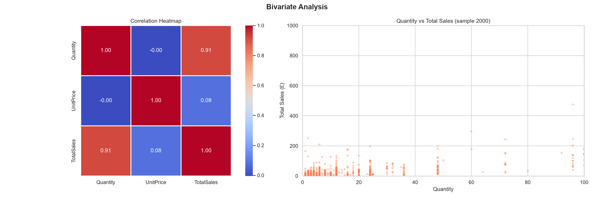
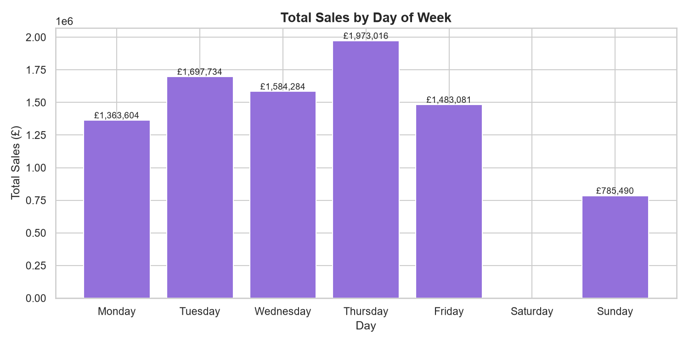

# 📊 E-Commerce Data Analysis & Reporting

---

## 🚀 Project Overview

This project performs **end-to-end E-Commerce Data Analysis and Reporting** using Python and Tableau.  
The workflow includes **data cleaning, preprocessing, exploratory analysis, visualization, and dashboard development** to generate business insights and support decision-making.

---

## 🛠️ Tech Stack

| Category | Tools |
|----------|------|
| Language | Python |
| Data Processing | Pandas, NumPy |
| Visualization | Matplotlib, Seaborn |
| Dashboard | Tableau Public |
| Version Control | GitHub |
| Dataset | CSV |

---

## 📌 Key Features

✅ Data Cleaning & Preprocessing  
✅ Exploratory Data Analysis (EDA)  
✅ Revenue Trend Analysis  
✅ Customer Behavior Analysis  
✅ Product Performance Analysis  
✅ Country-wise Sales Analysis  
✅ Interactive Dashboard  

---

## 📷 Project Screenshots

### Univariate Analysis

### Top Revenue Analysis

### Time Series Analysis

### Bivariate Analysis

### Sales by Day

---

## 📈 Interactive Tableau Dashboard

🔗 **View Dashboard:**  
👉 https://public.tableau.com/app/profile/harshit.saxena4505/viz/readynesttask1DataAnalysis/Dashboard2?publish=yes

---

## 💡 Key Insights

📍 UK generated highest revenue  
📍 November showed peak sales  
📍 12 PM recorded maximum orders  
📍 Top products identified through sales analysis  
📍 International markets showed growth opportunities  

---

## 👨‍💻 Author

**Harshit Saxena**

GitHub: https://github.com/HarBit-sys
